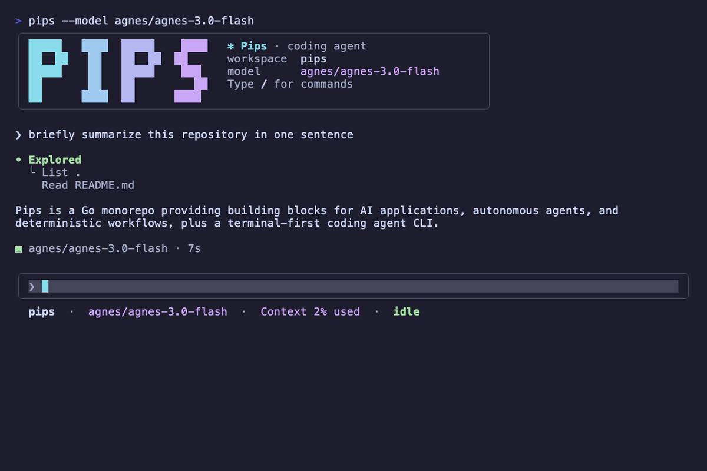
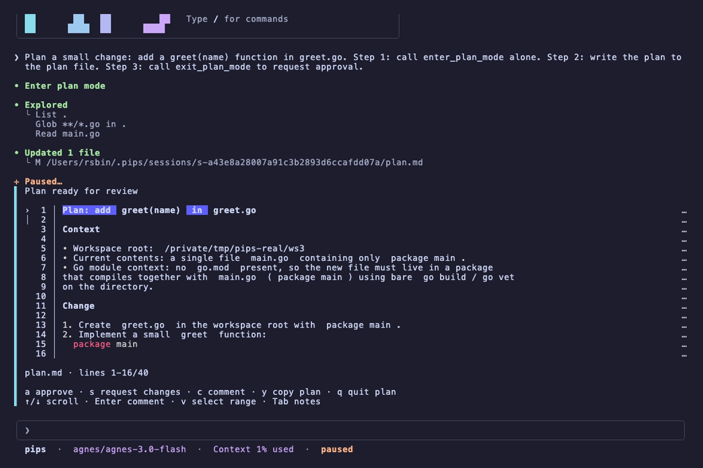
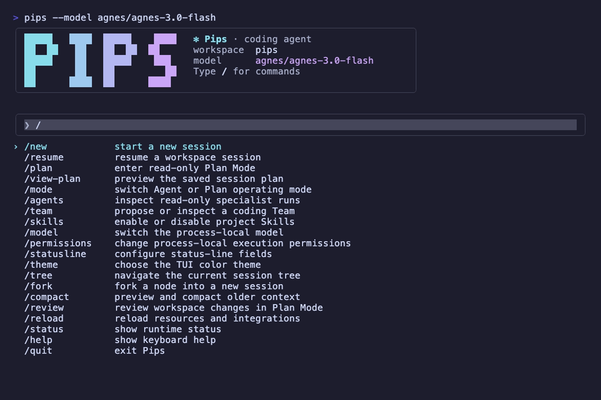

# Pips

English | [简体中文](README.zh-CN.md)

[](https://github.com/rsbin1178/pips/actions/workflows/quality.yml)

Pips is a set of native Go building blocks for AI applications, autonomous
agents, and deterministic workflows. The same repository also ships `pips`, a
local, terminal-first coding agent with explicit approval and sandbox
boundaries.

> **Status: v0.** Public APIs are under active development and may change.
> Pin a module version or commit when you depend on Pips.

## Why Pips

- **Native provider protocols.** The `ai` adapters speak OpenAI Chat
  Completions and Responses, Anthropic Messages, and Gemini generateContent
  without vendor SDKs. Portable requests cover streaming, tools, structured
  output, reasoning, images, and embeddings while retaining provider-specific
  escape hatches.
- **Separate control models.** Use `agent` when a model should decide which
  tool to call; use `workflow` when the process must follow a versioned graph.
  The Workflow runtime does not depend on the AI or Agent packages.
- **A coding product built on explicit authority.** The Coding CLI combines
  durable sessions, Plan Mode, workspace tools, subagents, teams, MCP, ACP, and
  SSH with operation-scoped approvals and native command sandboxes.

## Choose your path

| Path | Start here | Best for |
| --- | --- | --- |
| AI and Agent libraries | [`ai`](https://pkg.go.dev/github.com/rsbin1178/pips/ai) · [`agent`](https://pkg.go.dev/github.com/rsbin1178/pips/agent) | Model calls, typed tools, controlled agent loops, sessions, and application-owned orchestration |
| Workflow runtime | [`workflow`](https://pkg.go.dev/github.com/rsbin1178/pips/workflow) | Versioned DAGs, fixed processes, schema validation, failure routes, interrupts, checkpoints, and node debugging |
| Coding Agent | [`cmd/pips`](cmd/pips) · [Coding CLI guide](docs/coding-cli.md) | Interactive or non-interactive coding work in a local or SSH workspace |

## Quick start

Pips currently follows the Go toolchain declared in [`go.mod`](go.mod) (Go
1.26.5).

### Build an agent

Add the packages to an existing Go module:

```sh
go get github.com/rsbin1178/pips/agent \
  github.com/rsbin1178/pips/ai/openai
```

Create `main.go`:

```go
package main

import (
	"context"
	"fmt"
	"log"
	"os"
	"strconv"

	"github.com/rsbin1178/pips/agent"
	"github.com/rsbin1178/pips/ai"
	"github.com/rsbin1178/pips/ai/openai"
)

func main() {
	model := openai.New(
		"gpt-6-astra",
		openai.WithAPIKey(os.Getenv("OPENAI_API_KEY")),
	)

	add := agent.NewTool(
		"add",
		"Add two integers.",
		func(_ context.Context, input struct {
			A int `json:"a" description:"First addend"`
			B int `json:"b" description:"Second addend"`
		}) (string, error) {
			return strconv.Itoa(input.A + input.B), nil
		},
	)

	a, err := agent.New(
		model,
		agent.WithSystem("Use the add tool for arithmetic."),
		agent.WithTools(add),
		agent.WithMaxTurns(8),
	)
	if err != nil {
		log.Fatal(err)
	}

	result, err := a.Run(
		context.Background(),
		agent.NewSession(),
		ai.UserText("What is 128 + 256?"),
	)
	if err != nil {
		log.Fatal(err)
	}

	fmt.Printf("%s (%s)\n", result.Text(), result.Stop)
}
```

Run it with a credential supplied by your environment or secret manager:

```sh
export OPENAI_API_KEY='...'
go run .
```

The checked-in [`examples/agent-basic`](examples/agent-basic) adds guardrails,
events, and usage reporting to the same loop. For direct model calls, start
with the [AI quick start](docs/ai/quickstart.md); for tool approvals and durable
sessions, continue with the [Agent guide](docs/agent/index.md).

### Run the Coding CLI

Install the latest published source version:

```sh
go install github.com/rsbin1178/pips/cmd/pips@latest
pips --help
```

Create `~/.pips/config.toml` with one model. A single configured model is
selected automatically:

```toml
mode = "agent"
sandbox = "workspace-write"
approval = "on-request"

[providers.openai.models."your-model-id"]
```

The Coding CLI reads the selected provider credential from the provider-neutral
`API_KEY` environment variable. Check the configuration, credential, and native
sandbox before starting the TUI:

```sh
export API_KEY='...'
pips doctor
pips
```

Run one request without the TUI, or start with narrowed Plan Mode capabilities:

```sh
pips exec "review the current changes"
pips --mode plan
```

`pips doctor` is intentionally strict. In the default `workspace-write` mode,
Linux requires a working Bubblewrap 0.8.0+ sandbox and macOS uses the system
Seatbelt sandbox. See [Coding execution security](docs/coding-security.md) for
the platform and threat-model boundaries.

### Screenshots

A real session in the TUI: the model explores the workspace, patches files, and
reports what changed.



Plan Mode writes the plan to a session plan file and asks for review before any
workspace edit.



Slash commands, including `/plan`, are searchable from the command palette.



## Capability map

### Go libraries

| Package | Responsibility |
| --- | --- |
| `ai` | Provider-neutral messages, native-wire adapters, sync and streaming generation, tools, structured output, reasoning, vision, images, embeddings, typed errors, middleware, and observability hooks |
| `agent` | Bounded model/tool loop, typed tools, event streaming, stop conditions, guardrails, approvals, steering, nested runs, and serializable sessions |
| `workflow` | Strict versioned definitions, typed bindings and schemas, Actions, conditions, selectors, merges, sub-workflows, batches, loops, failure routes, partial runs, node debugging, interrupts, checkpoints, retries, and concurrency limits |
| `agent/harness` | Append-only session trees, branching, context compaction, summaries, cancellation, Skills, and prompt resources |
| `agent/continuation`, `agent/goal`, `agent/loop` | Application-driven durable execution, evidence-based completion policy, and persisted activation decisions without a resident scheduler |
| `agent/team` | Durable members, dependency tasks, exclusive claims and attempts, mailboxes, and scoped coordination tools; applications still own workers and scheduling |
| `agent/extension`, `agent/bundle`, `agent/mcp` | Trusted compiled-in extensions, bounded local declarative bundles, and immutable tool snapshots from official MCP client sessions |

The core layers are intentionally composable. Bare `ai` providers make one
attempt; add retry, rate limiting, and observability explicitly. An `Agent` is
immutable and safe to share, while each mutable `Session` admits only one
active run. Workflow definitions contain data rather than executable code;
applications register Actions and own their side effects.

### Coding Agent

The `pips` application adds a product layer over the libraries:

- interactive TUI, `exec`, durable resume/fork flows, attachments, themes, and
  shell completion;
- Agent and Plan modes with structured questions and explicit plan review;
- workspace-scoped read, patch, shell, Git inspection, and image tools;
- operation-scoped approvals, durable approval recovery, and native command
  sandboxes that fail closed when capability checks fail;
- built-in subagents, opt-in Alpha custom Agents, dependency-aware Coding
  Teams, Skills, MCP servers, Agent Plugins, Extensions, Bundles, and lifecycle
  Hooks;
- ACP v1 over stdio and exact-version remote TUI sessions over system OpenSSH.

Workspace trust enables project-owned resources for one invocation; it does not
approve tools, scripts, MCP servers, Full Access, or project configuration.
Optional integrations contribute capabilities but do not silently expand
authority.

## Project status and boundaries

- Pips is currently `v0`; compatibility work is ongoing and no stable release
  contract is claimed.
- Provider capabilities and model names differ. Static capability metadata is
  a hint, not a substitute for the selected provider's documentation or an
  actual request.
- Workflow is an in-process runtime, not a remote worker system. Hosts own
  Action idempotency, checkpoint storage, encryption, retention, authorization,
  and stable API or database projections.
- The Coding sandbox constrains model-generated commands but is not a complete
  secret-isolation or resource-quota boundary. Use a disposable environment,
  container, or VM when the repository or host is not trusted.
- Dynamic custom Coding Agents are Alpha and disabled by default. Their
  [readiness runbook](docs/coding-dynamic-subagents-readiness.md) defines the
  evidence required before broader release claims.

## Documentation

| Topic | Guide |
| --- | --- |
| AI interfaces, providers, tools, structured output, middleware, and testing | [AI package guide](docs/ai/index.md) |
| Agent runtime, control, persistence, orchestration, extensions, and MCP | [Agent package guide](docs/agent/index.md) |
| Agent composition patterns | [Agent composition](docs/agents.md) |
| Workflow public API and runtime contracts | [Workflow Go Reference](https://pkg.go.dev/github.com/rsbin1178/pips/workflow) |
| Coding CLI, configuration, sessions, SSH, and custom Agents | [Coding CLI contract](docs/coding-cli.md) |
| Sandbox, approvals, credentials, Full Access, and the threat model | [Coding execution security](docs/coding-security.md) |
| Agent Client Protocol v1 | [ACP guide](docs/coding-acp.md) |
| Local lifecycle command review and trust | [Coding lifecycle Hooks](docs/coding-hooks.md) |
| End-to-end capability validation and evidence collection | [Coding Agent manual acceptance](docs/manual-acceptance/index.md) |

## Examples

| Goal | Examples |
| --- | --- |
| Call OpenAI, Anthropic, or Gemini | [`text-stream-openai`](examples/text-stream-openai) · [`text-stream-anthropic`](examples/text-stream-anthropic) · [`text-stream-gemini`](examples/text-stream-gemini) |
| Switch providers or add middleware | [`provider-switch`](examples/provider-switch) · [`middleware`](examples/middleware) |
| Use tools, structured output, vision, or image generation | [`tools`](examples/tools) · [`structured`](examples/structured) · [`vision`](examples/vision) · [`image-gen`](examples/image-gen) |
| Build Agent control and persistence | [`agent-basic`](examples/agent-basic) · [`agent-stream`](examples/agent-stream) · [`agent-approval`](examples/agent-approval) · [`agent-harness`](examples/agent-harness) |
| Compose agents | [`agent-subagent`](examples/agent-subagent) · [`team-agent`](examples/team-agent) |

## Development and contributing

Clone the repository, then use the checked-in Make targets:

```sh
make help
make test-short
make vet
make lint
make build
```

`make p0-verify` runs the broader Coding Agent quality and security gate,
including race tests, provider adapter smoke tests, dependency verification,
and vulnerability auditing. Some native sandbox tests are platform-dependent;
see the [manual acceptance guide](docs/manual-acceptance/index.md) before making
platform or external-provider claims.

Issues and pull requests are welcome. Keep changes scoped, add tests for
behavior changes, run the relevant Make targets, and document user-visible
contracts without including secrets or unverifiable product claims.
