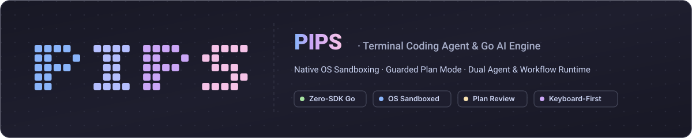
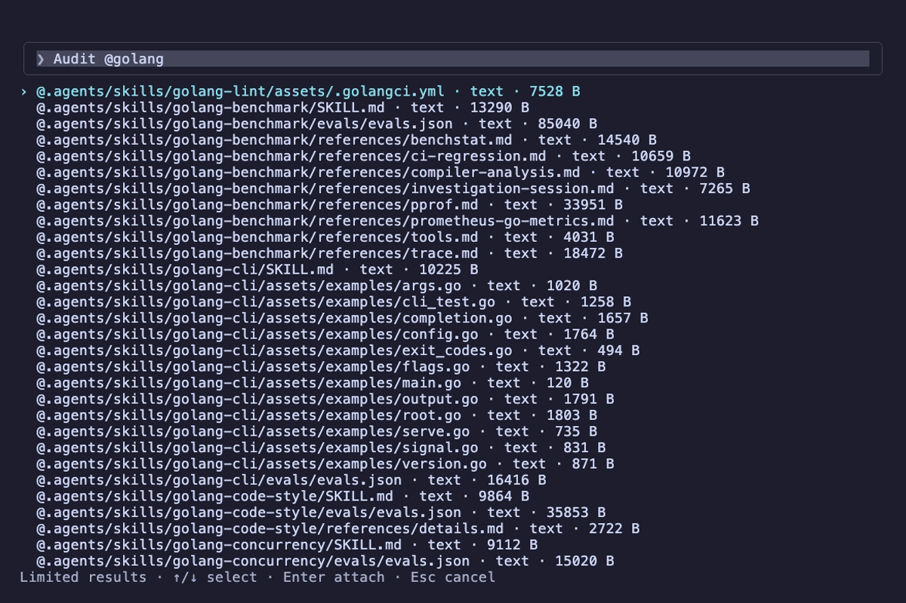
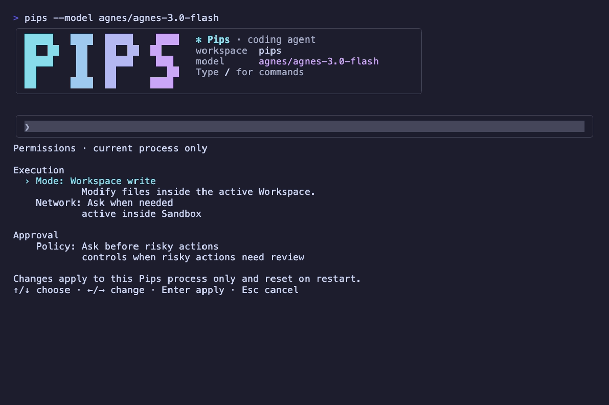
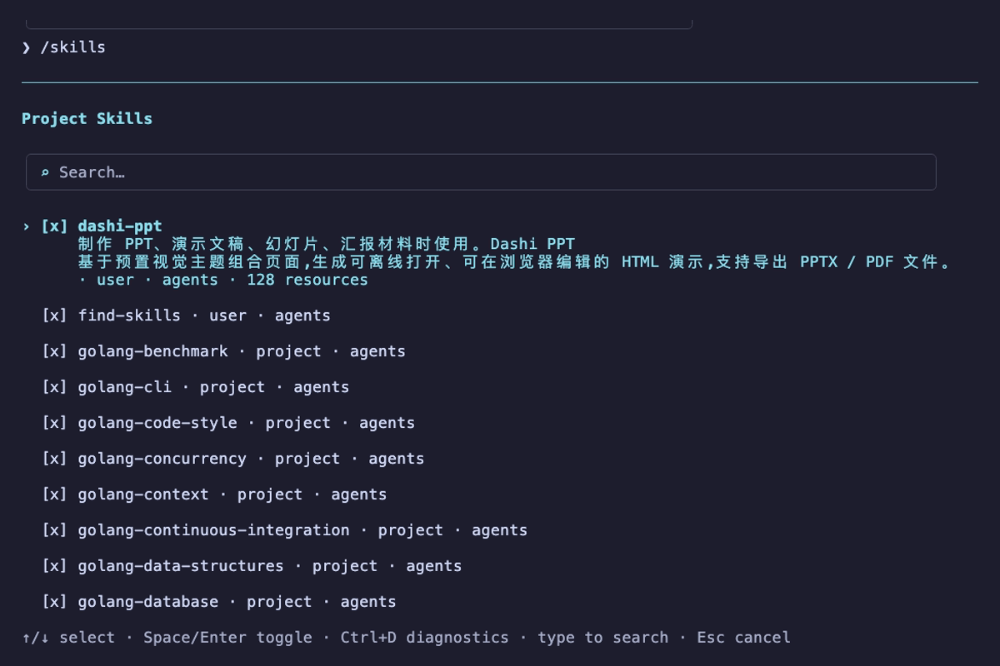
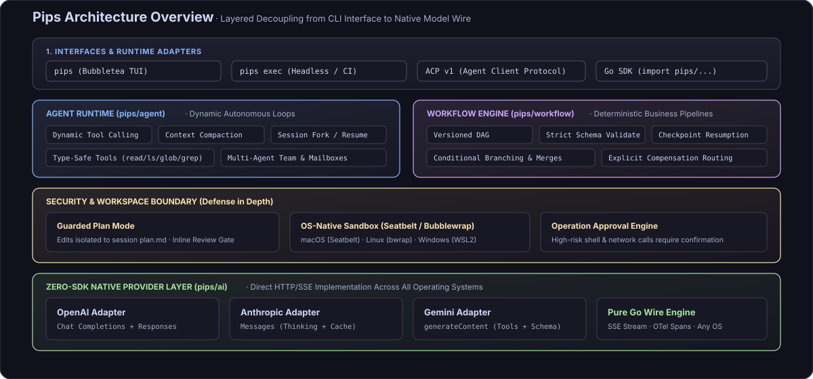

<p align="center">
  
</p>

<p align="center">
  <b>Terminal-First Coding Agent &amp; Native Go AI Development Engine</b>
</p>

<p align="center">
  <a href="https://github.com/rsbin1178/pips/actions/workflows/quality.yml"></a>
  <a href="https://pkg.go.dev/github.com/rsbin1178/pips"></a>
  
  
  
</p>

<p align="center">
  <a href="#quick-start">Quick Start</a> •
  <a href="#key-features">Key Features</a> •
  <a href="#interface-preview">Visual Tour</a> •
  <a href="#architecture">Architecture</a> •
  <a href="#documentation">Documentation</a> •
  <a href="README.zh-CN.md">简体中文</a>
</p>

---

Pips is an AI development toolkit for Go developers. It provides two core components:

1. **Terminal Coding Agent (`pips`)**: A responsive, keyboard-driven coding companion featuring native command sandboxing, operation approvals, and an isolated Plan Mode.
2. **Go AI Core Libraries**: Lightweight, pure Go building blocks for building autonomous decision-making agents (`agent`) or deterministic execution pipelines (`workflow`).

> **Status**: Currently at version `v0`. Public APIs are actively evolving. When adopting in production, please pin your dependency to a specific tag or commit hash.

---

## Interface Preview

### Live Interactive Session

The model streams reasoning traces in real time, exploring workspace directories, reading files, and writing patches with precision.


---

### Guarded Plan Mode

For multi-file edits or complex refactors, the model drafts an implementation plan in an isolated session file. You can inspect proposed changes line by line, add inline comments (`c`), request revisions (`s`), or approve execution (`a`). Edits are blocked until explicitly authorized.


---

### Interactive Overlays & Controls

Pips provides a full keyboard-first terminal control suite covering command search, file context attachment, sandboxing, and skills extensibility:

| Slash Command Palette (`/`) | File Context Attachment (`@`) |
| :---: | :---: |
|  |  |
| *Global command discovery, session resumption, and mode toggling* | *Fuzzy match repository files to inject into model context* |

| Sandbox & Permissions (`/permissions`) | Project Skills Hub (`/skills`) |
| :---: | :---: |
|  |  |
| *OS-level sandbox scopes (macOS/Linux), network isolation, and approvals* | *Project-level skill discovery, hot-toggling, and diagnostics* |

---

## Key Features

- **Guarded Plan Mode**: Implementation plans are drafted in an isolated draft before altering any repository files. Features line-by-line inspection, inline comments, revision loops, and explicit approval gates.
- **Native Sandboxing & Operation Approvals**: Integrates with OS-native sandboxes (Seatbelt on macOS, Bubblewrap on Linux) to confine filesystem mutations to the workspace. High-risk shell operations require user confirmation.
- **Dual Control Models (Agent & Workflow)**: Use `agent` when tasks require dynamic exploration, reflection, and tool calling; use `workflow` when operations must follow deterministic, versioned DAGs, schema contracts, and checkpoint recovery.
- **Zero-SDK Native Protocol Adapters**: Direct HTTP/SSE clients for OpenAI (Chat Completions and Responses), Anthropic (Messages), and Gemini (generateContent) without third-party vendor SDK bloat or version conflicts.
- **Keyboard-First Terminal Experience**: Built with Bubbletea, featuring shortcut-driven navigation, session persistence (Resume/Fork), sliding-window context compaction, and Catppuccin Mocha high-contrast dark themes.

---

## Architecture

Pips enforces strict modular decoupling from interactive terminal frontends down to raw provider wire protocols:

<p align="center">
  
</p>

### Path Selection

| Path | Core Packages | Best For |
| :--- | :--- | :--- |
| **Coding CLI** | [`cmd/pips`](cmd/pips) · [CLI Guide](docs/coding-cli.md) | Interactive coding, terminal automation, Plan Mode, and remote SSH workspaces |
| **Agent SDK** | [`ai`](https://pkg.go.dev/github.com/rsbin1178/pips/ai) · [`agent`](https://pkg.go.dev/github.com/rsbin1178/pips/agent) | Embedding multi-model calls, typed tools, bounded decision loops, and session trees |
| **Workflow Engine** | [`workflow`](https://pkg.go.dev/github.com/rsbin1178/pips/workflow) | Building deterministic business pipelines with schema validation, conditional branching, and checkpoint resumes |

---

## Quick Start

Requires Go 1.26.5 or later.

### 1. Using the Coding CLI

Install the binary:

```sh
go install github.com/rsbin1178/pips/cmd/pips@latest
```

Create a minimal configuration at `~/.pips/config.toml`:

```toml
mode = "agent"
sandbox = "workspace-write"
approval = "on-request"

[providers.openai.models."gpt-5.6-luna"]
default = true
```

Configure your API Key, run diagnostics, and launch:

```sh
export API_KEY="sk-..."

# Verify sandbox support, credentials, and workspace status
pips doctor

# Start the interactive TUI
pips
```

Common command variations:

```sh
# Run a single non-interactive task
pips exec "add a health check endpoint to main.go"

# Start directly in Plan Mode
pips --mode plan

# Resume a specific previous session
pips resume <session-id>
```

> **Sandbox Requirements**: In the default `workspace-write` mode, macOS uses system Seatbelt, while Linux requires Bubblewrap (0.8.0+). On Windows, running inside WSL2 is recommended for native Bubblewrap sandbox enforcement. The Go core libraries (`ai` / `agent` / `workflow`) are natively cross-platform and run directly on macOS, Linux, and Windows. See [Coding Execution Security](docs/coding-security.md) for details.

---

### 2. Using the Go Libraries

Add dependencies to your Go module:

```sh
go get github.com/rsbin1178/pips/agent github.com/rsbin1178/pips/ai/openai
```

Build a type-safe autonomous agent:

```go
package main

import (
	"context"
	"fmt"
	"log"
	"os"
	"strconv"

	"github.com/rsbin1178/pips/agent"
	"github.com/rsbin1178/pips/ai"
	"github.com/rsbin1178/pips/ai/openai"
)

func main() {
	// 1. Initialize native provider adapter
	model := openai.New(
		"gpt-6-astra",
		openai.WithAPIKey(os.Getenv("OPENAI_API_KEY")),
	)

	// 2. Define a typed business tool
	add := agent.NewTool(
		"add",
		"Add two integers.",
		func(_ context.Context, input struct {
			A int `json:"a" description:"First addend"`
			B int `json:"b" description:"Second addend"`
		}) (string, error) {
			return strconv.Itoa(input.A + input.B), nil
		},
	)

	// 3. Construct the agent instance
	a, err := agent.New(
		model,
		agent.WithSystem("Use the add tool for arithmetic operations."),
		agent.WithTools(add),
		agent.WithMaxTurns(8),
	)
	if err != nil {
		log.Fatal(err)
	}

	// 4. Run the turn and get the result
	result, err := a.Run(
		context.Background(),
		agent.NewSession(),
		ai.UserText("What is 128 + 256?"),
	)
	if err != nil {
		log.Fatal(err)
	}

	fmt.Printf("Answer: %s (Stop Reason: %s)\n", result.Text(), result.Stop)
}
```

For more examples, check the [`examples/`](examples/) directory.

---

## Design Principles & Security Boundaries

1. **Explicit Over Implicit**: Workspace writes, outbound network calls, and sensitive actions require explicit user configuration or authorization.
2. **In-Process Simplicity**: Workflows and agents are designed as embeddable, in-process Go runtimes without mandatory external queues or database daemons.
3. **Defense in Depth**: The command sandbox confines model-generated commands and workspace writes. For untrusted codebases, running in disposable containers or VMs is still recommended.

---

## Documentation

- [AI Package Guide](docs/ai/index.md)
- [Agent Core Runtime Guide](docs/agent/index.md)
- [Agent Composition & Patterns](docs/agents.md)
- [Workflow Engine Go Reference](https://pkg.go.dev/github.com/rsbin1178/pips/workflow)
- [Coding CLI Guide](docs/coding-cli.md)
- [Execution Security & Sandboxing](docs/coding-security.md)
- [Agent Client Protocol (ACP) Guide](docs/coding-acp.md)
- [Manual Acceptance Guidelines](docs/manual-acceptance/index.md)

---

## Development

```sh
# Run fast tests
make test-short

# Run linters
make lint

# Run full verification suite
make p0-verify
```

Contributions via [Issues](https://github.com/rsbin1178/pips/issues) and Pull Requests are welcome.
