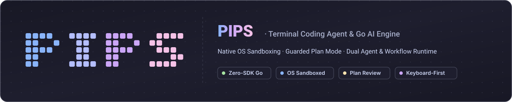
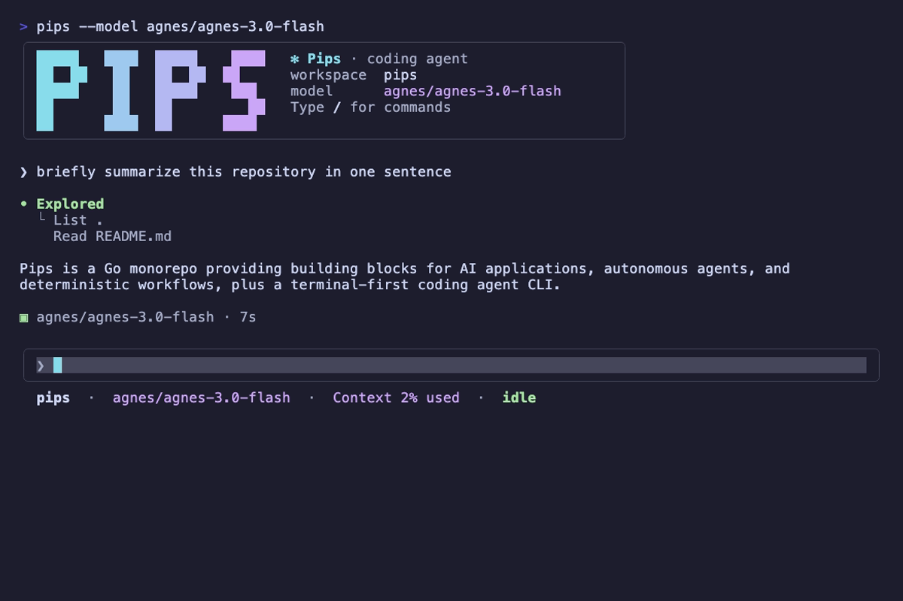
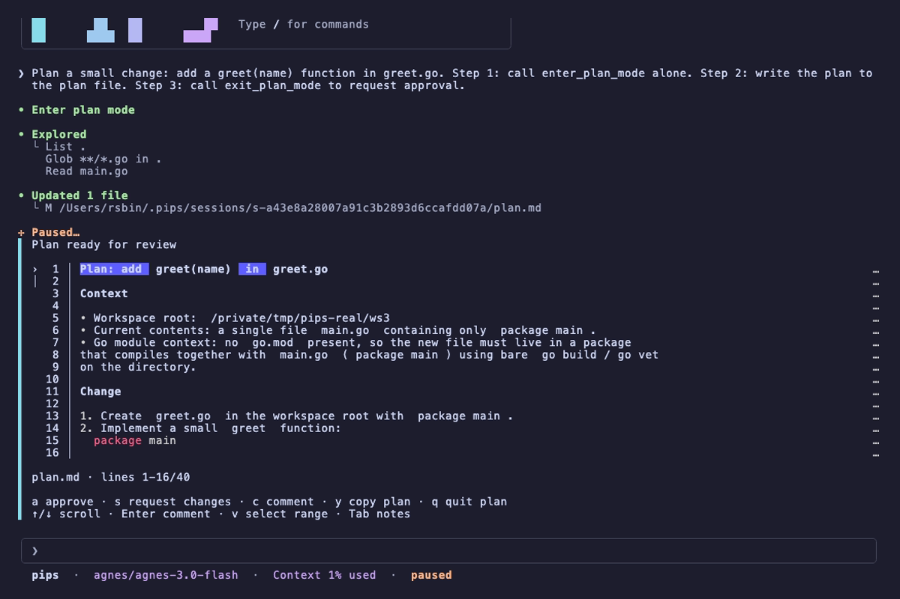
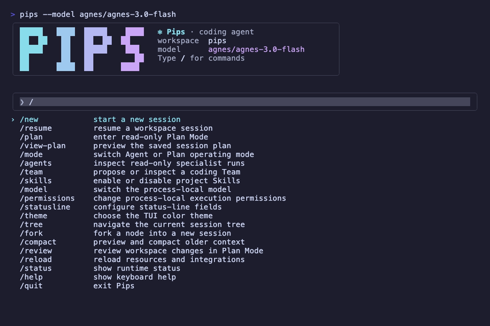
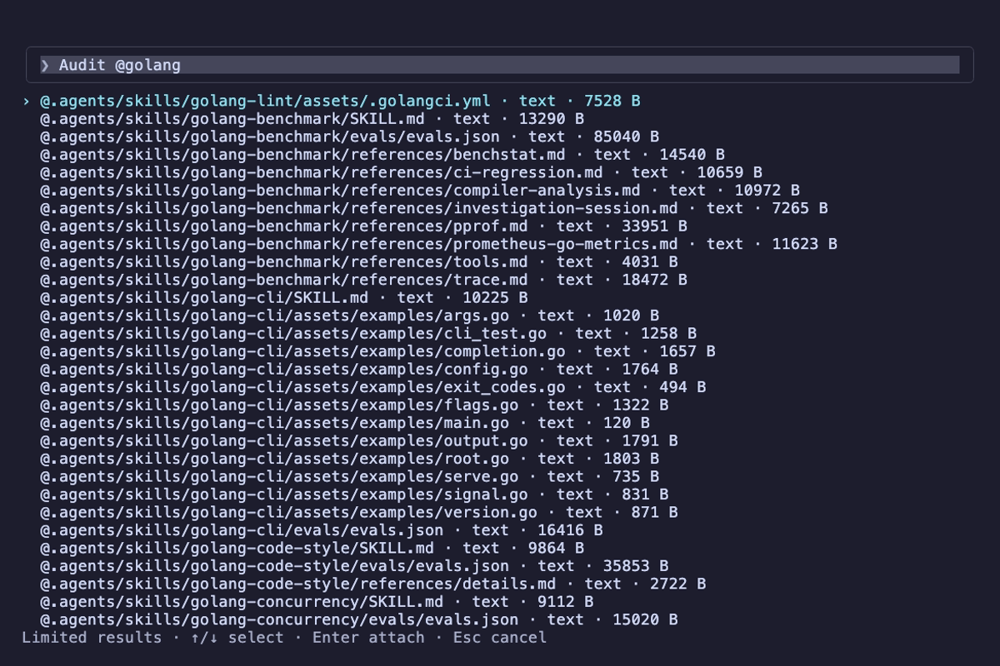
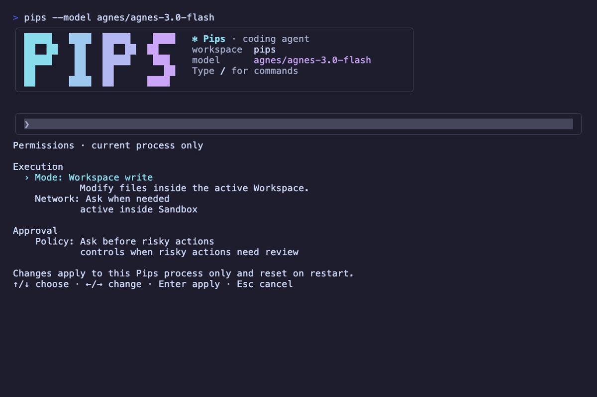
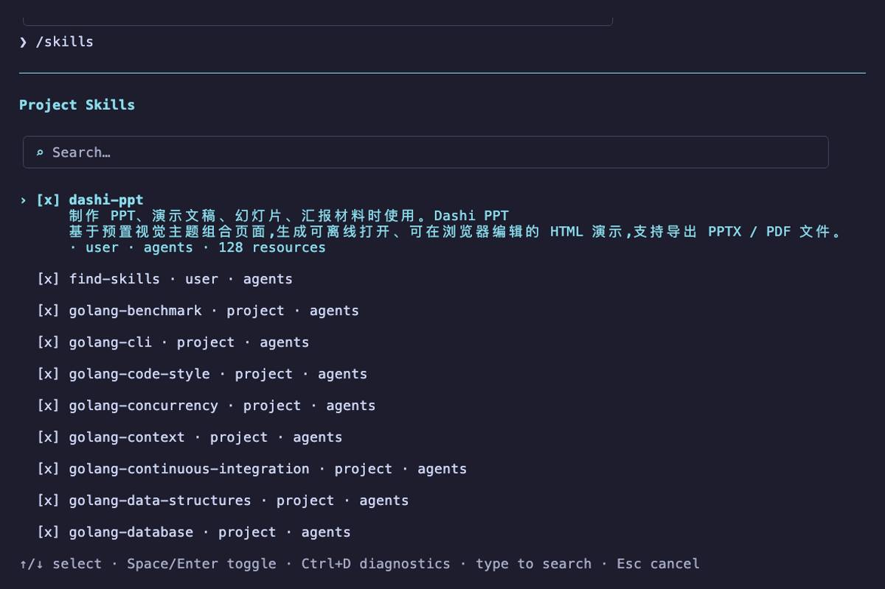
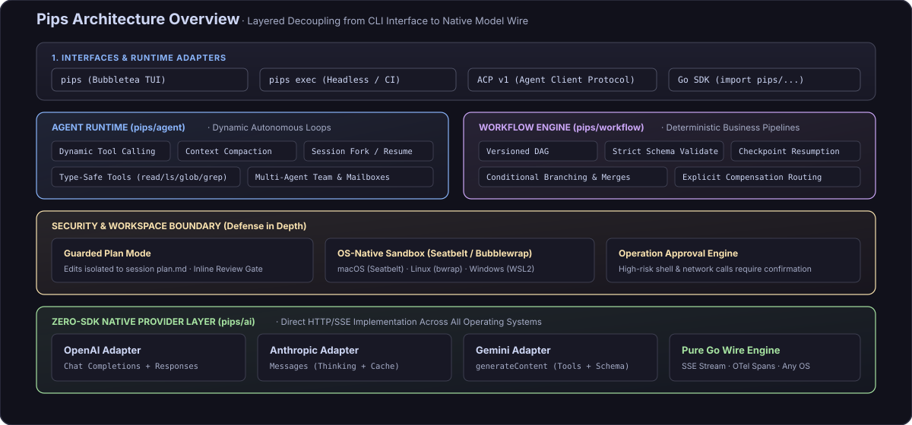

<p align="center">
  
</p>

<p align="center">
  <b>终端优先的 Coding Agent 与 Go 原生 AI 开发套件</b>
</p>

<p align="center">
  <a href="https://github.com/rsbin1178/pips/actions/workflows/quality.yml"></a>
  <a href="https://pkg.go.dev/github.com/rsbin1178/pips"></a>
  
  
  
</p>

<p align="center">
  <a href="#快速上手">快速上手</a> •
  <a href="#核心特性">核心特性</a> •
  <a href="#界面预览">界面预览</a> •
  <a href="#架构全景">架构全景</a> •
  <a href="#开发文档">开发文档</a> •
  <a href="README.md">English</a>
</p>

---

Pips 是一个专为 Go 开发者打造的 AI 项目，包含两个核心组成部分：

1. **终端 Coding Agent（`pips`）**：运行在本地终端的高性能交互式代码助手，内置原生沙箱隔离、操作逐项审批和只读草稿计划模式（Plan Mode）。
2. **Go AI 原生基础库**：一组轻量、纯 Go 的模块，支持构建自主决策与工具调用的 Agent（`agent`），或运行确定性业务管道与 DAG 的工作流引擎（`workflow`）。

> **项目状态**：当前处于 `v0` 快速迭代阶段，公开 API 仍在持续演进。在生产项目中引入时建议固定版本 tag 或 commit hash。

---

## 界面预览

### 终端交互全景

模型实时输出思考链路，在工作区内执行受控的文件检索、代码阅读与补丁生成。



---

### 受控计划模式（Plan Mode）

对于涉及多文件或复杂重构的任务，模型必须先在独立草稿中拟定实施计划。用户可在交互界面中逐行审阅、添加批注（`c`）、请求修改（`s`）或授权实施（`a`），未经批准严禁篡改工作区代码。



---

### 交互组件与控制面板

Pips 终端提供完整的键盘优先交互套件，涵盖全局命令检索、文件上下文注入、原生沙箱与扩展技能体系：

| 斜杠命令面板 (`/`) | 智能文件引用 (`@`) |
| :---: | :---: |
|  |  |
| *全局命令极速检索、会话恢复与模式切换* | *键入 `@` 模糊检索项目文件并无缝注入上下文* |

| 原生沙箱与权限配置 (`/permissions`) | 扩展技能中心 (`/skills`) |
| :---: | :---: |
|  |  |
| *操作系统底层沙箱（macOS/Linux）、网络隔离与审批策略* | *工程化技能发现、热插拔启用与诊断状态* |

---

## 核心特性

- **受控计划模式（Plan Mode）**：修改文件前先在独立会话草稿中提出实施方案，通过逐行高亮审阅与行级批注确认后，再行进入落地实施。
- **原生沙箱与显式审批**：在 macOS（Seatbelt）和 Linux（Bubblewrap）上调用操作系统底层沙箱，写入与执行限制在工作区根目录以内；高危 Shell 操作逐项请求确认。
- **Agent 与 Workflow 双控制模型**：当任务需要模型自主推理、试错和调用工具时使用 `agent`；当业务要求严格确定性、版本化 DAG、Schema 校验与断点重试时使用 `workflow`。
- **零 SDK 依赖的原生适配**：直接对接 OpenAI（Chat & Responses）、Anthropic（Messages）与 Gemini（generateContent）底层 HTTP/SSE 原生协议，告别重量级三方 SDK 依赖与版本冲突。
- **键盘优先的终端体验**：基于 Bubbletea 开发，全界面支持快捷键导航、多轮会话持久化与分支恢复（Resume/Fork）、上下文动态压缩与 Catppuccin Mocha 高对比度暗色主题。

---

## 架构全景

Pips 采用分层解耦架构，从终端交互、运行时编排、安全边界到底层模型协议均保持严格内聚：

<p align="center">
  
</p>

### 核心选型指南

| 模块 / 路径 | 核心包 | 适用场景 |
| :--- | :--- | :--- |
| **Coding CLI** | [`cmd/pips`](cmd/pips) · [CLI 使用指南](docs/coding-cli.md) | 在本地终端或远程 SSH 主机上进行交互式代码编写、重构与脚本自动化 |
| **Agent 开发库** | [`ai`](https://pkg.go.dev/github.com/rsbin1178/pips/ai) · [`agent`](https://pkg.go.dev/github.com/rsbin1178/pips/agent) | 在自有 Go 应用中嵌入多模型调用、类型安全工具、有界决策循环与会话树 |
| **Workflow 引擎** | [`workflow`](https://pkg.go.dev/github.com/rsbin1178/pips/workflow) | 构建严谨的确定性业务管道，提供版本化 DAG、严格 Schema 校验与断点恢复 |

---

## 快速上手

### 1. 安装

**macOS 与 Linux**

```sh
curl -fsSL https://raw.githubusercontent.com/rsbin1178/pips/main/install.sh | sh
```

安装脚本会从 [GitHub Releases](https://github.com/rsbin1178/pips/releases) 下载对应平台的归档，用发布出来的
`SHA256SUMS` 校验 SHA-256，并把 `pips` 装进 `/usr/local/bin`、`/opt/homebrew/bin`、`~/.local/bin`、`~/bin`
中第一个可写的目录。**校验不通过就什么都不装。** 当该目录不在 `PATH` 上时，它会把 export 行追加到
`~/.zshrc`、`~/.bashrc` 与 `~/.profile`。

| 环境变量 | 作用 |
| --- | --- |
| `PIPS_VERSION` | 安装指定 tag（例如 `PIPS_VERSION=v0.1.7`），而不是最新发布 |
| `PIPS_BIN_DIR` | 指定安装目录，跳过上面的搜索顺序 |
| `PIPS_NO_MODIFY_PATH=1` | 不修改任何 shell 配置，只打印那行 `PATH` |
| `GH_TOKEN` | 用 token 访问 releases API，避开匿名速率限制 |

<details>
<summary>Windows、手动下载与源码构建</summary>

Windows 除 Linux/macOS 的归档外还提供 `pips_<tag>_windows_amd64.zip`：解压后把 `pips.exe` 放进 `PATH`，
并用 `SHA256SUMS` 校验。建议在 WSL2 中运行，这样默认的 `workspace-write` 沙箱才会生效。

归档命名为 `pips_<tag>_<os>_<arch>.tar.gz`，其中 `os` 为 `darwin` 或 `linux`，`arch` 为 `amd64` 或
`arm64`；解压、赋予可执行权限、放进 `PATH` 即可。

从源码构建要求 Go 1.26.6 或更高版本：

```sh
git clone --branch v0.1.7 https://github.com/rsbin1178/pips.git   # 或你需要的 tag
cd pips
go install ./cmd/pips
```

当前版本通过 `go.mod` 固定使用修复后的 Bubble Tea fork。Go 不支持对包含这类
`replace` 的目标模块执行 `go install ...@version`，请使用发布二进制或源码 checkout
安装。应用托管 viewport 的 TUI 重构不包含在本次发布中。

</details>

### 2. 使用终端 Coding Agent

创建基础配置文件 `~/.pips/config.toml`：

```toml
mode = "agent"
sandbox = "workspace-write"
approval = "on-request"

[providers.openai.models."gpt-5.6-luna"]
default = true
```

配置 API Key 并启动：

```sh
export API_KEY="sk-..."

# 运行环境诊断（检查沙箱、依赖与模型凭据）
pips doctor

# 启动交互式终端界面
pips
```

常用命令场景：

```sh
# 非交互式单次任务执行
pips exec "为当前目录下的 main.go 增加健康检查路由"

# 直接以 Plan 计划模式启动
pips --mode plan

# 恢复指定的历史会话
pips resume <session-id>
```

> **沙箱依赖说明**：在默认 `workspace-write` 模式下，macOS 使用系统自带 Seatbelt，Linux 需要预装 Bubblewrap（0.8.0+）；Windows 用户建议在 WSL2 环境下运行以获取完整的 Bubblewrap 原生沙箱隔离。Go 核心开发库（`ai` / `agent` / `workflow`）则原生跨平台（macOS、Linux、Windows 均可直接运行）。详见 [Coding 执行安全规范](docs/coding-security.md)。

---

### 3. 作为 Go 基础库引入

在现有 Go 项目中引入核心模块：

```sh
go get github.com/rsbin1178/pips/agent github.com/rsbin1178/pips/ai/openai
```

编写一个包含类型化业务工具的自主 Agent：

```go
package main

import (
	"context"
	"fmt"
	"log"
	"os"
	"strconv"

	"github.com/rsbin1178/pips/agent"
	"github.com/rsbin1178/pips/ai"
	"github.com/rsbin1178/pips/ai/openai"
)

func main() {
	// 1. 初始化原生协议模型适配器
	model := openai.New(
		"gpt-6-astra",
		openai.WithAPIKey(os.Getenv("OPENAI_API_KEY")),
	)

	// 2. 声明类型安全的业务工具
	add := agent.NewTool(
		"add",
		"Add two integers.",
		func(_ context.Context, input struct {
			A int `json:"a" description:"First addend"`
			B int `json:"b" description:"Second addend"`
		}) (string, error) {
			return strconv.Itoa(input.A + input.B), nil
		},
	)

	// 3. 构建 Agent 执行循环
	a, err := agent.New(
		model,
		agent.WithSystem("Use the add tool for arithmetic operations."),
		agent.WithTools(add),
		agent.WithMaxTurns(8),
	)
	if err != nil {
		log.Fatal(err)
	}

	// 4. 执行多轮交互并获取结果
	result, err := a.Run(
		context.Background(),
		agent.NewSession(),
		ai.UserText("What is 128 + 256?"),
	)
	if err != nil {
		log.Fatal(err)
	}

	fmt.Printf("Answer: %s (Stop Reason: %s)\n", result.Text(), result.Stop)
}
```

更多示例可参考代码库中的 [`examples/`](examples/) 目录。

---

## 设计哲学与安全边界

1. **显式配置优先**：工作区写入、外部网络连接与命令调用均需显式配置或用户确认，杜绝隐式猜测执行。
2. **进程内轻量设计**：核心模块均为轻量纯 Go 原生实现，无外部消息队列或后台常驻进程依赖。
3. **纵深防御策略**：操作系统沙箱用于约束模型生成的命令与工作区写入范围。在处理完全不可信的外部代码仓库时，建议配合一次性容器或虚拟机进行物理级隔离。

---

## 文档索引

- [AI 接口与多模型适配指南](docs/ai/index.md)
- [Agent 核心运行时与生命周期](docs/agent/index.md)
- [Agent 组合与多智能体协作模式](docs/agents.md)
- [Workflow 引擎 API 参考](https://pkg.go.dev/github.com/rsbin1178/pips/workflow)
- [Coding CLI 配置与完整命令说明](docs/coding-cli.md)
- [执行安全威胁模型与沙箱机制](docs/coding-security.md)
- [Agent Client Protocol (ACP) 说明](docs/coding-acp.md)
- [人工验收测试规范](docs/manual-acceptance/index.md)

---

## 开发与贡献

```sh
# 运行单元测试
make test-short

# 代码规范与质量检查
make lint

# 全量质量门控校验
make p0-verify
```

欢迎提交 [Issues](https://github.com/rsbin1178/pips/issues) 与 Pull Requests 共同建设。

---

## 授权协议

本项目基于 [Apache License 2.0](LICENSE) 授权。

Copyright 2026 rsbin1178。署名与第三方组件授权信息见 [NOTICE](NOTICE)。
